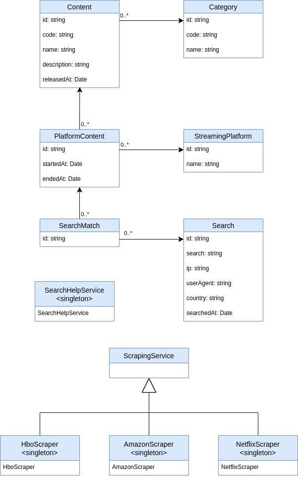

# Diseño

En este documento se describen las principales decisiones sobre el diseño del Software que se han tomado.

Se programará según el paradigma de **Programación Orientada a Objetos**, donde los elementos del sistema serán instancias de clases, que por medio de mensajes a otras instancias o clases llevan a cabo todas las funcionalidades.

Se implementará el sistema con **TypeScript** ya que el sistema se desplegará en la nube y podremos hacer uso de las númerosas librerías que hay para Node. A su vez, usar TypeScript nos permitirá declarar los tipos de las variables, y de esta forma aportar robustez al sistema.

## Diagrama de Clases de Diseño

En el Diagrama de Clases del Diseño se representan todas las clases necesarias en el proyecto, sus propiedades y tipo, y las relaciones entre ellas.

